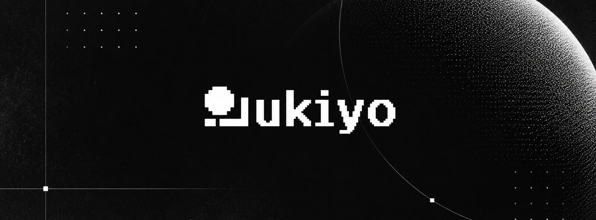
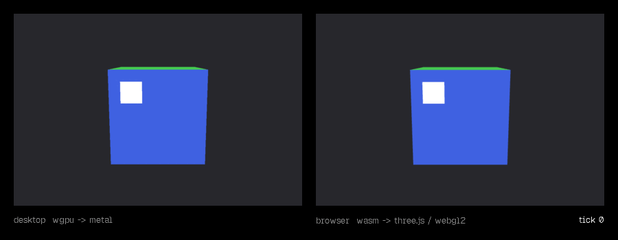

<div align="center">

<picture>
  <source media="(prefers-color-scheme: dark)" srcset=".github/assets/banner-dark.jpg">
  <source media="(prefers-color-scheme: light)" srcset=".github/assets/banner-light.jpg">
  
</picture>

<h3>The world is code. Agents build it. You watch every tick.</h3>

A C# game engine designed from its first line for coding agents and the people who direct them.<br>
One program runs natively, in the browser and headless, with no editor in between.

<br>

[](docs/G0.md)
[](https://dotnet.microsoft.com/)
[](#how-it-works)
[](#quickstart)
[](LICENSE)

[Quickstart](#quickstart) · [How it works](#how-it-works) · [Roadmap](#roadmap) · [G0 report](docs/G0.md) · [Protocol](docs/protocol.md)

</div>

<br>

<div align="center">
  
  <br>
  <sub>Same <code>Program.cs</code>. Left: native window, wgpu → Metal. Right: browser, .NET WebAssembly → three.js.<br>Every frame was read back from each renderer at the same tick. Nothing here is a mockup.</sub>
</div>

<br>

## Why ukiyo

Game engines were built around a person holding a mouse. The editor owns the truth, code gets attached to it, and
anything automated has to poke at it from the outside.

ukiyo starts from the other end.

- **The code is the world.** Scenes, entities, transforms and components are plain C#. There is no hidden editor state to reverse-engineer: what a person or an agent writes is exactly what runs.
- **Agents are native, not bolted on.** Fixed 60 Hz ticks, headless runs, structured snapshots, typed errors and build-stamped evidence are engine features. Tool protocols sit on top as thin adapters; they are not the product.
- **Humans stay in the loop.** A studio window, on the roadmap, shows what agents are doing, lets you review their changes and take over at any point, without ever becoming the source of truth.
- **One program, every target.** Renderers implement one contract. The same `Program.cs` runs on wgpu/Metal, in the browser through WebAssembly, and with no GPU at all.
- **Games ship alone.** A desktop export is a single native executable. A web export is a folder of static files. No editor, daemon or model at runtime.

## What 0.0.1 already proves

| | |
|---|---|
| One source, three targets | Every host prints the SHA-256 of the shared game files. They match on desktop, web, headless and both AOT builds. |
| Real renderers | wgpu-native on Metal (Apple M4 Pro) and three.js on WebGL2, plus a null renderer that never touches a GPU. |
| Identical simulation | Rotation at ticks 0, 60, 180 and 600 is bit-for-bit equal across all targets. |
| Nothing moves behind your back | Paused in the browser, 1.5 s of real time advance zero ticks and consecutive frames are pixel-identical. |
| One edit, everywhere | Changing only `CubeGame.cs` changes every target the same way; renderer code is untouched. |
| Single binary | `rotating-cube` is one 10.3 MB NativeAOT executable with wgpu and SDL linked in. It runs copied alone into an empty folder. |
| Static web | The published site runs from any static file server, in IL or WebAssembly-AOT form. |

All of it is reproducible with one script and documented in the [G0 report](docs/G0.md), including what is still open.

## Quickstart

Apple Silicon Mac with the .NET 10 SDK (`10.0.401`), Xcode command line tools, cmake, ninja and [bun](https://bun.sh).

```sh
git clone https://github.com/Obed0101/ukiyo && cd ukiyo
scripts/fetch-native.sh                  # pinned wgpu-native + SDL3, static and shared
(cd web/three-adapter && bun install)    # pinned three.js
```

Run the same game three ways:

```sh
dotnet run --project samples/RotatingCube/Headless   # no window, no GPU
dotnet run --project samples/RotatingCube/Desktop    # native window, wgpu → Metal  (space: pause · S: step)

dotnet publish samples/RotatingCube/Browser -c Release -o artifacts/web
python3 -m http.server --directory artifacts/web/wwwroot 8080   # open http://localhost:8080
```

Ship it:

```sh
dotnet publish samples/RotatingCube/Export.Desktop -c Release -o artifacts/desktop
./artifacts/desktop/rotating-cube        # one file: no .NET, no dylibs, no editor
```

Verify everything, end to end (opens a window for a few seconds):

```sh
scripts/g0.sh
```

## The shape of a game

This is the entire entry point. Every host compiles this exact file:

```csharp
return await GameApplication.RunAsync(new CubeGame(), PlatformBootstrap.Create(args));
```

The game owns its state and describes what to draw. Renderers only consume that description:

```csharp
public void Update(in TickInfo tick)
{
    _rotation = ExpectedRotation(tick.Tick + 1);
}

public void Extract(FrameBuilder frame)
{
    frame.Camera = FrameBuilder.LookAt(new Vector3(0f, 0.6f, 3.2f), Vector3.Zero, MathF.PI / 3f, 0.1f, 100f);
    frame.Draw(_mesh, _material, Pose.ToMatrix());
}
```

And every run tells you what it actually ran on:

```text
[ukiyo] target=desktop game=RotatingCube CubeGame.cs=9846313B6743 Program.cs=138C7579F527
[ukiyo] renderer=WgpuRenderer backend=Metal device="Apple M4 Pro () · wgpu-native 29.0.1.1" profile=G0Unlit capture=True
```

## How it works

```text
                     Program.cs + your game  (C#)
                                 │
          ukiyo runtime ─ fixed 60 Hz ticks · snapshots · typed errors · evidence
                                 │
                   RenderPacket  (binary protocol v1)
                                 │
          ┌──────────────────────┼──────────────────────┐
     WgpuRenderer          ThreeJsRenderer          NullRenderer
     wgpu → Metal          .NET WASM → three.js     no GPU
     native window         browser canvas           tests and agents
```

- The simulation never depends on a renderer. It produces presentation data; renderers consume it.
- Renderers never animate on their own. In the browser, `requestAnimationFrame` only forwards time to C#.
- Every boundary fails loudly: stale handles, truncated packets, NaNs and unknown versions become typed errors, never dropped frames.
- Wire format, conventions and limits: [protocol](docs/protocol.md) · [conventions](docs/conventions.md).

```text
src/Ukiyo.Render              renderer contract, handles, validation, protocol
src/Ukiyo.Core                fixed clock, IGame, runtime, snapshots
src/Ukiyo.Render.*            Null · Wgpu · Three
src/Ukiyo.Platform.*          Headless · Desktop (SDL3 + Metal) · Browser (WASM)
samples/RotatingCube/Shared   the one Program.cs and CubeGame.cs
web/three-adapter             three.js presentation adapter, no game rules
tests/Ukiyo.Tests             core, bridge and renderer contract tests
```

## Roadmap

- [x] **G0 · One program, two real renderers.** Metal and WebGL2 from the same C#, NativeAOT single binary, static web export.
- [ ] **G1 · Runtime slice.** Input and platform services, and a physics spike validated on CoreCLR, NativeAOT and WebAssembly.
- [ ] **G2 · Authoring and data.** Scenes and prefabs as code plus data, validated patches, the agent CLI and its tool adapters.
- [ ] **G3 · Studio and reload.** A human window onto a running game, a dev bridge from any editor, controlled reload.
- [ ] **G4 · Evidence and games.** Replays, visual conformance and the first real games, starting with the flight sim that began all this.

Each gate closes only with evidence. Order and scope can still change.

## The name

**浮世** *ukiyo*, the floating world. Ukiyo-e masters carved a woodblock once and printed it again and again.
ukiyo carves your game once and prints it on every target.

## Contributing

It is early and the architecture is still moving. Issues and discussions are welcome; for anything larger than a
small fix, open an issue first. Run `dotnet test tests/Ukiyo.Tests` and `scripts/g0.sh` before sending changes to
the core.

## Credits

Built on [wgpu-native](https://github.com/gfx-rs/wgpu-native), [SDL](https://github.com/libsdl-org/SDL),
[three.js](https://github.com/mrdoob/three.js) and [.NET](https://github.com/dotnet/runtime). The wordmark is set in
[Geist Pixel](https://github.com/vercel/geist-pixel-font) (SIL OFL).

## License

[MIT](LICENSE) © 2026 Obed González and the ukiyo contributors.

<br>

<div align="center">
  <picture>
    <source media="(prefers-color-scheme: dark)" srcset=".github/assets/brand/ukiyo-mark-white.svg">
    
  </picture>
</div>
